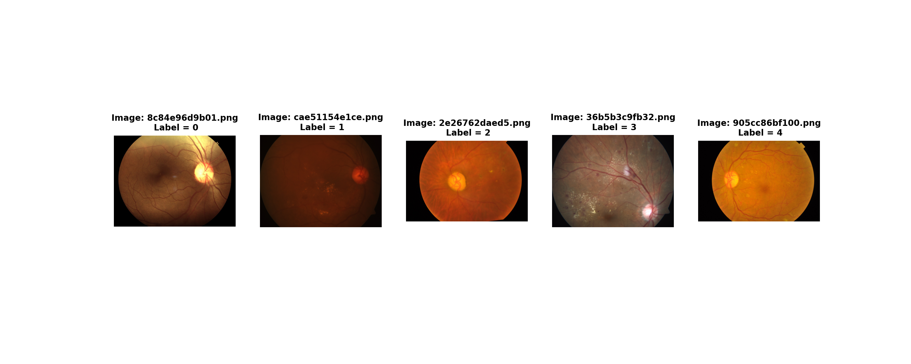
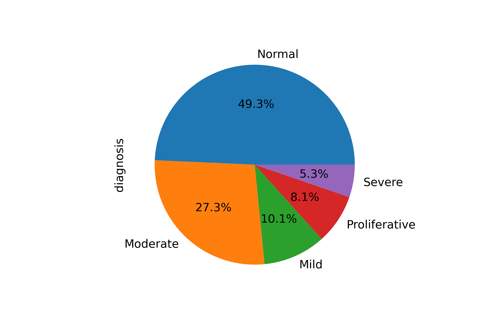

# Imaging classification of diabetic retinopathy pathology using machine learning techniques

This project was carried out in 2022 during the [SCC0276] Machine Learning course at the University of São Paulo (USP) at the Institute of Mathematical and Computer Sciences (ICMC). The objective is the detection and classification of diabetic retinopathy, a disease that affects individuals with diabetes. This is a complex task, as the classification must be done among 5 options: normal, mild, moderate, severe, and proliferative. Thus, the entire process of data analysis, preprocessing, and classification will be conducted, considering different algorithms.

## Group:

- Alessandro de Freitas Guerreiro - 11233891
- Matheus Yasuo Ribeiro Utino - 11233689
- Vinícius Silva Montanari - 11233709

## Data Analysis

### Real Images

As we can see from the image below, it is not a trivial task to identify the severity of the disease, especially for individuals who are not from the domain area. Additionally, the images were taken from different angles and exhibit various colorations, which significantly complicates the task. This is where the major challenge of the project lies, to find the nuances of each degree of the disease.

### Distribution of classes

According to the pie chart, it can be observed that the dataset is highly imbalanced, which poses another major challenge in dealing with classes with a lower number of samples. Therefore, sampling techniques will need to be employed.

## Methods

### Preprocessing

#### Oversampling

As indicated, there is a strong imbalance in the dataset, and to address this issue, various algorithms were employed, such as RandomOverSampler, Synthetic Minority Over-sampling Technique (SMOTE), Borderline-SMOTE, and Adaptive Synthetic (ADASYN).

#### Image treatment

The dataset consists of high-dimensional images with various sizes, so it was necessary to standardize and resize them. Additionally, the image pixels range from 0 to 255, but a standardization was performed to range between -1 and 1.

#### Feature extraction

In this step, for the traditional classification algorithms, feature extraction was performed using fine-tuning on EfficientNetB3.

#### Classification

Finally, in the classification step, KNN, Decision Tree, SVM, and CNN were used. Three distinct metrics were analyzed: accuracy, F1-score, and Quadratic Weighted Kappa.

## Results

We can observe from the table the best result for each classification algorithm, where different hyperparameters and oversampling techniques were tested.

|                           **Method**                          | **Accuracy** | **F1-Macro** | **Quadratic Weighted Kappa** |
|:-------------------------------------------------------------:|:------------:|:------------:|:----------------------------:|
|       KNN No oversampling (K = 7, weights = 'distance')       |     0.795    |     0.577    |             0.831            |
| Decision tree Borderline-SMOTE (crit = ’entropy’, max dp = 5) |     0.638    |     0.466    |             0.751            |
|              SVM ADASYN (C = 10, kernel = ’poly’)             |     0.820    |     0.650    |           **0.881**          |
|                     CNN (No oversampling)                     |   **0.840**  |   **0.679**  |             0.877            |

## Conclusion

Analyzing the metrics, we can observe that even when using oversampling techniques, the issue of imbalance is still present, as evidenced by the difference between accuracy and F1-macro metrics. The CNN model stands out as the best performer, even without oversampling techniques, achieving superior performance compared to the other methods, only falling behind SVM in terms of the Quadratic Weighted Kappa metric.
